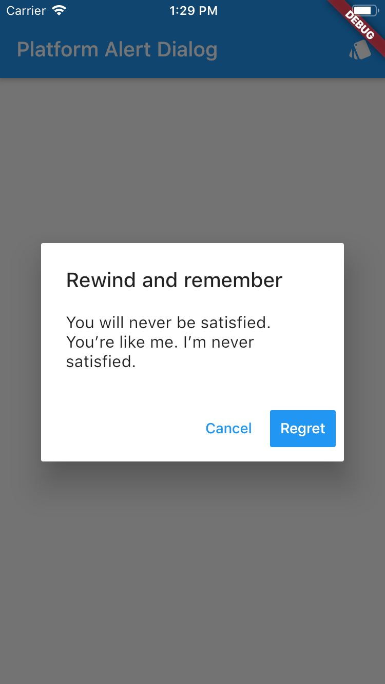
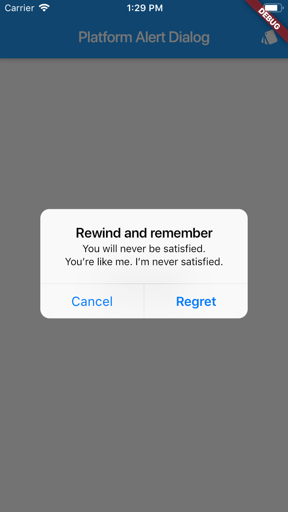

# Platform Alert Dialog

Flutter plugin for build alert dialogs adapted to the current platform.

```dart
showDialog<void>(
  context: context,
  builder: (BuildContext context) {
    return PlatformAlertDialog(
      title: Text('Rewind and remember'),
      content: SingleChildScrollView(
        child: ListBody(
          children: <Widget>[
            Text('You will never be satisfied.'),
            Text('You\’re like me. I’m never satisfied.'),
          ],
        ),
      ),
      actions: <Widget>[
        PlatformDialogAction(
          child: Text('Cancel'),
          onPressed: () {
            Navigator.of(context).pop();
          },
        ),
        PlatformDialogAction(
          child: Text('Regret'),
          actionType: ActionType.Preferred,
          onPressed: () {
            Navigator.of(context).pop();
          },
        ),
      ],
    );
  },
);
```

### Example

Screenshot with theme Android      |  Screenshot with theme iOs
:---------------------------------:|:------------------------------:
 | 
